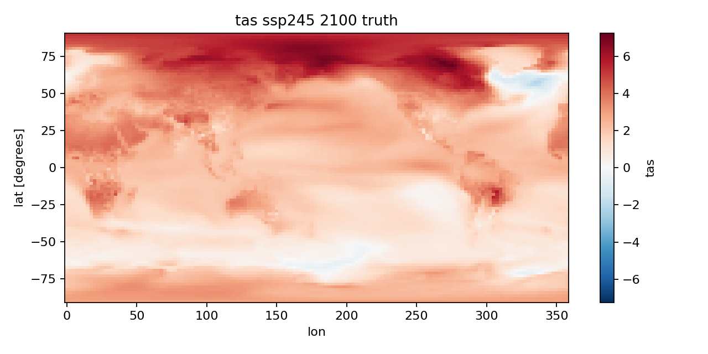
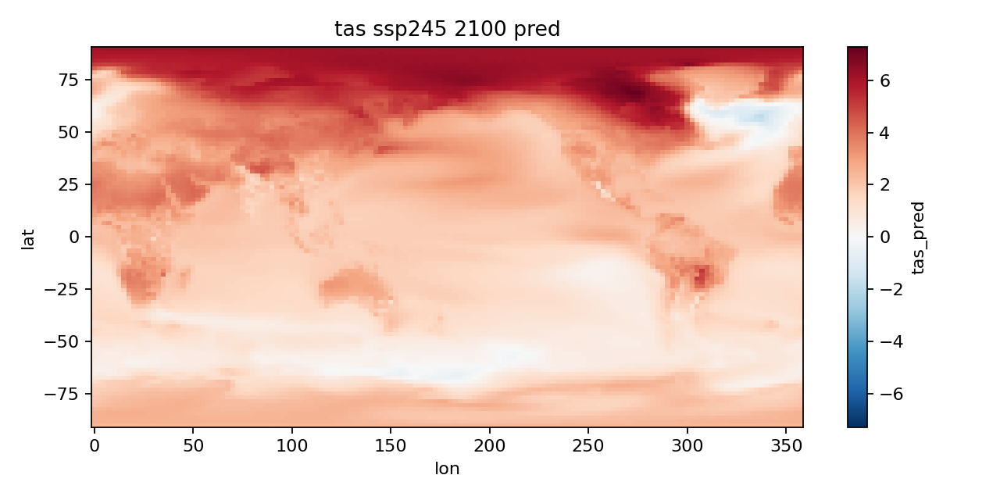
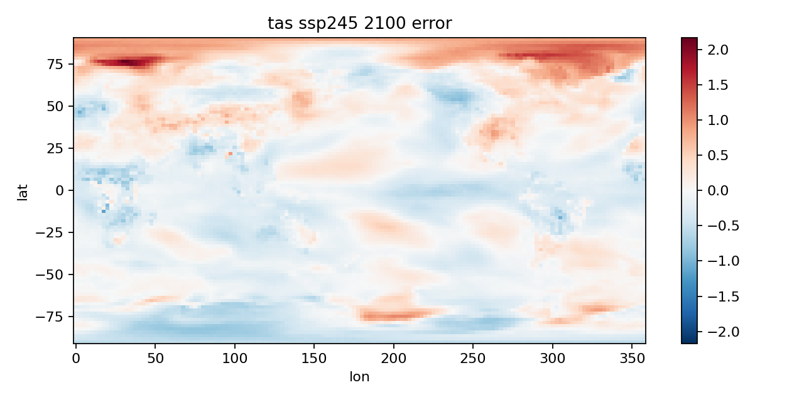
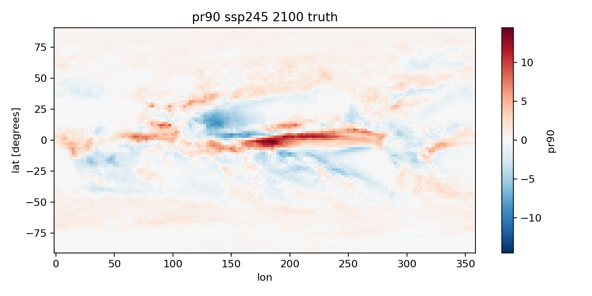
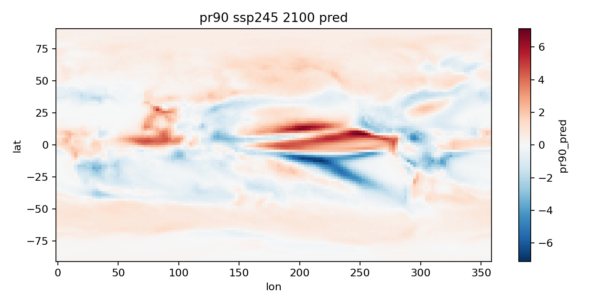
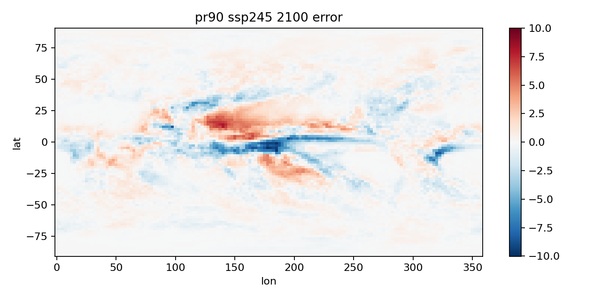

# ClimateBench-MindSpore 作业报告

## 1. 背景介绍

为评估不同减排政策的长期影响，研究人员需要回答一个核心问题：在给定二氧化碳、甲烷和气溶胶等人为排放路径后，未来全球及各区域的气候将如何变化。完整地球系统模式（Earth System Model, ESM）能够通过大气、海洋、陆地、海冰和生物地球化学过程的耦合计算给出较可靠的预测，是气候研究的重要工具。然而，这类模式计算量巨大，一次百年尺度模拟便需要大量算力和时间，因此只能覆盖少数共享社会经济路径（SSP），难以充分搜索可能的排放情景空间，也不便用于政策优化、敏感性分析和不确定性量化。

传统替代方法主要包括脉冲响应模型和模式缩放。前者物理含义清晰，但通常只能预测全球平均响应，难以刻画区域差异；后者依据全球平均温升缩放空间分布，对近似线性的温度变化较有效，却难以表示降水等变量的非线性响应，也常忽略硫酸盐气溶胶和黑碳造成的区域影响。机器学习气候仿真器则可从地球系统模式的历史模拟中学习“外部强迫到气候响应”的映射，以远低于 ESM 的成本快速生成全球格点预测。

ClimateBench 为该任务提供了统一的数据集、训练测试划分和评价指标。数据来自 NorESM2 地球系统模式，输入包括累计 CO2 排放、CH4 排放以及具有空间分布的 SO2 和黑碳排放，输出包括近地表气温、日较差、平均降水和极端降水四类年平均异常场。该任务的主要挑战在于：训练样本有限且相邻年份高度相关；不同强迫具有不同时间尺度和空间效应；降水及极端事件响应非线性强；自然内部变率会给监督信号引入噪声；模型既要正确预测全球变化趋势，又要保留北极放大、热带辐合带移动等区域结构。本作业使用 MindSpore 复现 CNN-LSTM 基线，以卷积网络提取空间特征，并利用 LSTM 表示气候对多年强迫的滞后响应。

## 2. 问题定义

ClimateBench 可形式化为一个时空监督回归问题。设第 $t$ 年的外部强迫为 $\mathbf{X}_t\in\mathbb{R}^{H\times W\times C}$，其中 $H=96$、$W=144$、$C=4$，四个通道依次表示 CO2、CH4、SO2 和黑碳。CO2 与 CH4 原本是全球时间序列，输入模型前广播到全部格点；SO2 与黑碳保留其经纬度分布。为表示气候系统的滞后效应，模型使用长度为 $L=10$ 年的滑动窗口：

$$
\mathcal{X}_t=(\mathbf{X}_{t-L+1},\ldots,\mathbf{X}_t)
\in\mathbb{R}^{L\times H\times W\times C}.
$$

对于气候变量 $v\in\{\mathrm{tas},\mathrm{DTR},\mathrm{pr},\mathrm{pr90}\}$，目标为 NorESM2 在第 $t$ 年相对于工业化前控制试验气候态的异常场 $\mathbf{Y}_t^{(v)}\in\mathbb{R}^{H\times W}$。三个集合成员的结果先取平均，以减弱内部变率。模型 $f_{\theta}^{(v)}$ 学习映射

$$
\widehat{\mathbf{Y}}_t^{(v)}=f_{\theta}^{(v)}(\mathcal{X}_t),
$$

四个变量分别训练，参数通过最小化训练样本上的均方误差获得：

$$
\theta_v^*=\arg\min_{\theta}\frac{1}{N}
\sum_{n=1}^{N}\left\|f_{\theta}^{(v)}(\mathcal{X}_n)-\mathbf{Y}_n^{(v)}\right\|_2^2.
$$

训练数据由 historical、SSP126、SSP370、SSP585、hist-GHG 和 hist-aer 组成，SSP245 完全留作测试，从而检验模型对未见排放路径的插值能力。评价时需同时考察区域形态和全球趋势。对格点场 $\mathbf{Z}$，考虑纬度方向网格面积缩小，定义面积加权全球均值

$$
\langle\mathbf{Z}\rangle_w=
\frac{\sum_{i=1}^{H}\sum_{j=1}^{W}\cos(\phi_i)Z_{ij}}
{\sum_{i=1}^{H}\sum_{j=1}^{W}\cos(\phi_i)},
$$

其中 $\phi_i$ 为第 $i$ 个纬度。记 2080-2100 年测试期长度为 $T$，预测场和真实场的时间平均分别为 $\overline{\mathbf{Y}}^{\mathrm{pred}}$ 和 $\overline{\mathbf{Y}}^{\mathrm{true}}$，归一化尺度为真实场在该时期的全球平均变化幅度

$$
D=\left|\left\langle\overline{\mathbf{Y}}^{\mathrm{true}}\right\rangle_w\right|.
$$

空间指标比较多年平均气候变化图，衡量区域格局是否准确：

$$
\mathrm{NRMSE}_s=
\frac{\sqrt{\left\langle
(\overline{\mathbf{Y}}^{\mathrm{pred}}-
\overline{\mathbf{Y}}^{\mathrm{true}})^2
\right\rangle_w}}{D}.
$$

全球指标则逐年计算面积加权全球均值的差异，用于衡量长期变化幅度和时间演化是否正确：

$$
\mathrm{NRMSE}_g=
\frac{\sqrt{\frac{1}{T}\sum_{t=1}^{T}
\left(\langle\widehat{\mathbf{Y}}_t\rangle_w-
\langle\mathbf{Y}_t\rangle_w\right)^2}}{D}.
$$

ClimateBench 将两个指标组合为

$$
\mathrm{NRMSE}_{\mathrm{total}}=
\mathrm{NRMSE}_s+5\,\mathrm{NRMSE}_g.
$$

指标越小，表示模型既能重建空间变化格局，又能准确预测全球平均变化幅度。系数 5 用于平衡两部分对总分的贡献，避免仅凭格点误差较小便掩盖全球趋势偏差；以真实响应幅度 $D$ 归一化后，量纲和数值范围不同的温度、日较差、降水及极端降水任务也可以采用统一形式进行比较。因此，本任务并非普通的单点时间序列预测，而是同时受时间依赖、空间结构和全球物理统计约束的高维回归问题。

## 3. 研究现状

气候模式仿真研究最初主要依赖低维物理模型和模式缩放方法。以 MAGICC6 为代表的简化气候模型用少量方程描述碳循环、辐射强迫和海洋热响应，可以快速估计不同排放路径下的全球平均温度，具有计算成本低、物理含义清晰的优点[1]。然而，这类模型通常只提供全球均值，无法直接回答区域气候如何变化。模式缩放则假设局地气候变化格局能够随全球平均温升按比例调整，从而以较小代价获得空间投影。研究表明，该假设对近似线性的温度响应较有效，但对降水、极端事件以及具有明显区域效应的气溶胶强迫适用性有限[2]。

随着地球系统模式试验数据不断积累，统计仿真器开始直接学习外部强迫与气候响应之间的映射。Castruccio 等基于预先计算的全球气候模式试验构建统计模型，实现了区域温度场的快速生成[3]；MESMER 将全球平均温度轨迹映射到陆地格点，并显式描述自然内部变率，为区域风险研究提供了概率化结果[4]；Mansfield 等进一步证明，机器学习可以利用较短期模拟预测长期气候变化的空间格局，显示出减少昂贵模式积分的潜力[5]。这些工作推动气候仿真从简单线性缩放发展为能够处理非线性、多尺度和空间相关性的统计学习问题。

现有数据驱动仿真器采用了多种模型。高斯过程能够用核函数描述平滑的非线性响应，并同时给出预测均值和不确定性，但计算复杂度会随样本量增加；随机森林擅长刻画变量间的非线性交互，特征重要性也便于解释，但树模型通常不适合外推到训练范围之外；卷积神经网络可提取气溶胶排放和气候响应的空间结构，循环神经网络则能够表示海洋热惯性等导致的时间滞后。ESEm 等开源地球系统仿真平台为高斯过程、随机森林和神经网络提供了较统一的训练、采样与校准接口，降低了不同方法的比较难度[6]。与此同时，深度学习研究逐渐从单纯追求预测精度转向结合地球系统过程知识、可解释性和物理一致性[7]。将能量守恒等解析约束嵌入网络结构或损失函数，已被证明有助于减少不合理预测并提高模型在未见条件下的可靠性[8]。

统一数据集和评价协议的出现进一步促进了方法比较。WeatherBench 为数据驱动天气预报建立了标准化数据和指标体系[9]，但天气预报主要关注初值驱动的短期演变，而气候投影关注外部强迫下数十年至百年尺度的统计响应。ClimateBench 因此使用 NorESM2 的 CMIP6、ScenarioMIP、AerChemMIP 和 DAMIP 试验，构建了面向气候投影的统一基准，并比较模式缩放、高斯过程、随机森林和 CNN-LSTM 等方法[10]。结果表明，机器学习能够较好模拟温度、日较差、降水及极端降水的全球与区域响应，其中神经网络在多个任务的全球均值预测上表现突出。不过，有限且高度相关的训练样本、自然内部变率、跨情景外推、极端降水的强非线性以及预测的物理可信性仍是关键难题。当前研究正向概率化、多变量联合建模、跨模式迁移和物理约束学习发展，目标是在计算效率、预测精度、不确定性刻画与物理一致性之间取得平衡，使气候仿真器能够可靠支持情景探索、风险评估和气候归因。

## 4. 论文方法

本作业并非只把原论文的网络层名称替换成 MindSpore API。我们以官方 `CNN-LTSM_model.ipynb` 为参照，将数据准备、时序样本构造、CNN-LSTM 网络、四变量训练、SSP245 推理、官方指标和空间可视化完整重建为可独立执行的工程。实验运行在华为云 ModelArts Notebook，使用 Python 3.7.10、MindSpore 1.7.0 和 NVIDIA Tesla T4 GPU。我们的迁移原则是保持科学任务、数据语义、输入输出形状和网络信息流一致，再针对 MindSpore 的张量布局、网络封装和训练接口完成适配。

### 4.1 数据协议与样本构造

原代码使用 historical、SSP126、SSP370、SSP585、hist-GHG 和 hist-aer 形成训练数据，并将 historical 与每个未来 SSP 场景连接，使预测情景初期时仍能获得前 9 年历史强迫。SSP245 完全留作测试。我们保持了这一划分，并继续使用 xarray 读取 NetCDF：输出变量沿 `member` 维求平均；pr 和 pr90 乘以 86400，由 kg m^-2 s^-1 转为 mm/day；CO2 和 CH4 从时间序列广播到 96×144 网格，SO2 和 BC 保留空间分布，最终堆叠为四通道输入。我们将经纬度名称统一为 `lat` 和 `lon`，将所有数组转为 `float32`，并将训练统计量保存为 JSON 供推理阶段复用。

我们沿用原版长度为 10 年的滑动窗口，并以窗口最后一年的气候场作为标签。我们将 notebook 中两套输入、输出切窗函数合并为一个显式保持时间坐标的函数：

```python
def make_windows(x, y, times, slider=10, start_index=0):
    xs, ys, out_times = [], [], []
    for i in range(start_index, x.shape[0] - slider + 1):
        target_idx = i + slider - 1
        xs.append(x[i:i + slider])
        ys.append(y[target_idx][None, :, :])
        out_times.append(times[target_idx])
    return np.asarray(xs, np.float32), np.asarray(ys, np.float32), np.asarray(out_times)
```

这样构造出的输入和标签形状分别为 `[N,10,96,144,4]` 与 `[N,1,96,144]`，共得到 726 个样本。`start_index` 用于控制 historical 与 SSP 接缝处的窗口起点，既保留历史上下文，又避免把同一历史标签重复加入多个场景。tas、pr、DTR 和 pr90 仍按原代码分别训练四个模型，保持不同物理变量的独立输出假设。

### 4.2 网络结构的逐层迁移

官方 Keras baseline 的核心结构如下。它先对 10 个时间步共享同一个二维卷积，再进行空间池化和全局平均，最后由 LSTM 汇总时间信息并输出全球格点场：

```python
cnn_model = Sequential()
cnn_model.add(Input(shape=(10, 96, 144, 4)))
cnn_model.add(TimeDistributed(
    Conv2D(20, (3, 3), padding="same", activation="relu")))
cnn_model.add(TimeDistributed(AveragePooling2D(2)))
cnn_model.add(TimeDistributed(GlobalAveragePooling2D()))
cnn_model.add(LSTM(25, activation="relu"))
cnn_model.add(Dense(96 * 144))
cnn_model.add(Reshape((1, 96, 144)))
```

MindSpore 1.7.0 没有直接照搬 Keras `TimeDistributed` 的必要。我们在 `ClimateCNNLSTM(nn.Cell)` 中先把输入从 `[B,T,H,W,C]` 转为 `[B,T,C,H,W]`，再合并批次和时间维，使同一个 `nn.Conv2d` 一次处理所有年份。这一做法与 `TimeDistributed` 的关键语义一致，即不同时间步共享卷积权重，而不是为每年建立独立卷积层。卷积后的 2×2 平均池化对应 Keras `AveragePooling2D(2)`，对空间维执行 `ReduceMean` 对应 `GlobalAveragePooling2D`；恢复为 `[B,T,20]` 后输入隐藏维为 25 的 `nn.LSTM`，取最后时间步，经 `nn.Dense(25,13824)` 重塑为 `[B,1,96,144]`：

```python
class ClimateCNNLSTM(nn.Cell):
    def construct(self, x):
        b, t, h, w, c = x.shape
        x = self.transpose(x, (0, 1, 4, 2, 3))
        x = self.reshape(x, (b * t, c, h, w))
        x = self.pool(self.relu(self.conv(x)))
        x = self.reduce_mean(x, (2, 3))
        x = self.reshape(x, (b, t, self.cnn_channels))
        out, _ = self.lstm(x)
        y = self.dense(out[:, -1, :])
        return self.reshape(y, (b, 1, self.lat, self.lon))
```

因此，我们实现的模型与原版模型在“逐年提取空间特征、压缩为空间摘要、汇总十年时间依赖、恢复全球场”的整体信息流上保持一致。我们也保留了卷积通道数 20、卷积核 3×3、same padding、平均池化、LSTM 隐藏维 25、线性输出 13824 个格点等结构参数。框架层面存在两项实现差异：原版使用 RMSProp，并为 Keras LSTM 指定 ReLU；我们采用学习率 0.001 的 Adam 和 MindSpore 标准 `nn.LSTM` 门控激活。因此，本作业追求网络功能和任务协议等价，而不是逐浮点数一致。

### 4.3 MindSpore 训练、推理与评价链路

原 notebook 通过 `model.compile(...); model.fit(...)` 隐式完成损失计算、反向传播和参数更新。我们将这些步骤映射为 MindSpore 原生组件：`NumpySlicesDataset` 负责随机打乱和批处理，`nn.MSELoss` 保持原版格点 MSE 目标，`NetWithLoss` 封装模型与损失，`nn.TrainOneStepCell` 完成单步梯度计算和参数更新。batch size 16 与 30 个 epoch 均与官方 baseline 一致：

```python
train_ds = ds.NumpySlicesDataset(
    {"x": X, "y": Y}, shuffle=True
).batch(16)

loss_fn = nn.MSELoss()
optimizer = nn.Adam(net.trainable_params(), learning_rate=1e-3)
train_net = nn.TrainOneStepCell(NetWithLoss(net, loss_fn), optimizer)

for batch in train_ds.create_dict_iterator():
    loss = train_net(batch["x"], batch["y"])
```

工程化复现还覆盖了 notebook 之外的完整产物管理。每轮训练记录 CSV 日志并保存 checkpoint，最终标准化参数单独保存；推理时重新加载 checkpoint 和训练统计量，将 historical 与 SSP245 拼接后按同一规则切窗，批量生成 2015-2100 年预测，并连同时间、纬度和经度坐标写回 NetCDF。评价阶段在 2080-2100 年计算纬度余弦面积加权的 Spatial NRMSE、Global NRMSE 和 `Spatial + 5×Global` 总分，并为四个变量输出 2030、2050、2100 年的真值、预测和误差图。由此，复现深度覆盖了原论文 CNN-LSTM 的数据协议、网络结构、训练规模、测试场景、评价指标和科学数据格式，而不是停留在单次前向传播或单变量示例层面。

## 5. 复现结果

本实验预测四个具有不同物理含义的目标变量。`tas` 是年平均近地表气温异常，主要反映温室气体驱动的整体增暖及其区域差异；`pr` 是年平均降水异常，用于描述水循环平均状态的变化；`DTR` 是每日最高与最低近地表气温之差的年平均异常，对陆海差异和气溶胶强迫较敏感；`pr90` 是逐年每日降水量的第 90 百分位异常，用于表示强降水变化。四者均相对于 NorESM2 工业化前控制试验气候态计算，其中 pr 和 pr90 以 mm/day 表示，tas 和 DTR 以 K 表示。选择这四项任务可以同时检验模型对近线性温度响应、非线性降水响应及极端事件的学习能力。

四个变量均完成 30 个 epoch 训练，并生成最终 checkpoint、SSP245 年度预测、评价 CSV 和空间分布图。训练数据张量为 `(726,10,96,144,4)`，标签为 `(726,1,96,144)`。tas 的平均 MSE 从首轮 2.7613 降至 0.2768，下降最明显；pr 从 0.3086 降至 0.2604，DTR 从 0.0600 降至 0.0303，pr90 从 2.6943 降至 2.2920。由于变量量纲和响应幅度不同，训练 MSE 不能直接横向比较，但四项任务的末轮损失均低于首轮，说明 MindSpore 训练链路能够稳定优化模型。

MindSpore 复现结果与论文 Neural Network baseline 对比如下。所有指标均在留出的 SSP245 场景上按 2080-2100 年计算，Spatial 衡量多年平均空间格局，Global 衡量全球均值时间演化，Total 为两者的加权总分，数值越低越好。百分比差值按 $(\mathrm{MindSpore\ Total}-\mathrm{原文\ Total})/\mathrm{原文\ Total}\times100\%$ 计算，负值表示本作业得到的总分更低。

| 变量 | MindSpore Spatial | 原文 Spatial | MindSpore Global | 原文 Global | MindSpore Total | 原文 Total | Total 百分比差值 |
|---|---:|---:|---:|---:|---:|---:|---:|
| tas | 0.0646 | 0.1073 | 0.0526 | 0.0440 | 0.3275 | 0.3274 | +0.02% |
| pr | 2.1815 | 2.1281 | 0.1683 | 0.2093 | 3.0231 | 3.1746 | -4.77% |
| DTR | 8.6731 | 9.9174 | 1.0709 | 1.3722 | 14.0277 | 16.7783 | -16.39% |
| pr90 | 2.3939 | 2.6102 | 0.3190 | 0.3457 | 3.9890 | 4.3388 | -8.06% |

tas 的总分为 0.3275，与原文 0.3274 几乎一致；其空间误差更低，而全球误差略高，组合后实现了高度接近的总体精度。pr 的总分为 3.0231，较原文降低约 4.8%，改善主要来自全球均值误差下降。DTR 和 pr90 的总分分别为 14.0277 和 3.9890，较原文降低约 16.4% 和 8.1%，空间项和全球项均有所改善。四项总分都达到与论文 baseline 相当的量级，说明 MindSpore 实现保留了 CNN-LSTM 对空间结构和多年滞后的建模能力。由于优化器、LSTM 激活、随机初始化和标准化统计与原实现存在差别，且没有进行多随机种子重复，这些数值不用于证明某一框架更优，而用于说明迁移复现达到了预期精度。

图 1 对比 2100 年 SSP245 下 tas 的真实场、预测场和误差场。预测结果正确再现了北半球高纬度显著增暖、北极放大以及北大西洋局地弱增暖或冷异常等主要结构，真值与预测图在大尺度分布上高度一致。误差主要集中于北半球高纬度、南大洋和部分陆地区域，热带及南半球部分区域存在轻微低估，但相对于整体增暖幅度较小，这与 tas 较低的 Spatial NRMSE 一致。

| 2100 年 tas 真值 | 2100 年 tas 预测 | 2100 年 tas 误差（预测减真值） |
|---|---|---|
|  |  |  |

图 2 展示更具挑战性的 pr90 结果。模型能够识别极端降水变化主要集中在赤道附近，并重现热带太平洋和印度洋附近的正负异常带，但预测场比真值更平滑，局地峰值强度和位置仍有偏差。误差集中在热带辐合带及其南北两侧，表明极端降水对局地环流、海气耦合和气溶胶影响更敏感，也解释了 pr90 的空间 NRMSE 明显高于 tas。总体而言，可视化结果与定量指标相互印证：模型能够稳定恢复大尺度气候响应，但对降水极值的精细空间结构仍有改进空间。

| 2100 年 pr90 真值 | 2100 年 pr90 预测 | 2100 年 pr90 误差（预测减真值） |
|---|---|---|
|  |  |  |

## 参考文献

[1] MEINSHAUSEN M, RAPER S C B, WIGLEY T M L. Emulating coupled atmosphere-ocean and carbon cycle models with a simpler model, MAGICC6-Part 1: Model description and calibration[J]. Atmospheric Chemistry and Physics, 2011, 11(4): 1417-1456. DOI:10.5194/acp-11-1417-2011.

[2] TEBALDI C, ARBLASTER J M. Pattern scaling: Its strengths and limitations, and an update on the latest model simulations[J]. Climatic Change, 2014, 122(3): 459-471. DOI:10.1007/s10584-013-1032-9.

[3] CASTRUCCIO S, MCINERNEY D J, STEIN M L, et al. Statistical emulation of climate model projections based on precomputed GCM runs[J]. Journal of Climate, 2014, 27(5): 1829-1844. DOI:10.1175/JCLI-D-13-00099.1.

[4] BEUSCH L, GUDMUNDSSON L, SENEVIRATNE S I. Emulating Earth system model temperatures with MESMER: From global mean temperature trajectories to grid-point-level realizations on land[J]. Earth System Dynamics, 2020, 11(1): 139-159. DOI:10.5194/esd-11-139-2020.

[5] MANSFIELD L A, NOWACK P J, KASOAR M, et al. Predicting global patterns of long-term climate change from short-term simulations using machine learning[J]. npj Climate and Atmospheric Science, 2020, 3(1): 44. DOI:10.1038/s41612-020-00148-5.

[6] WATSON-PARRIS D, WILLIAMS A, DEACONU L, et al. Model calibration using ESEm v1.1.0: An open, scalable Earth system emulator[J]. Geoscientific Model Development, 2021, 14(12): 7659-7672. DOI:10.5194/gmd-14-7659-2021.

[7] REICHSTEIN M, CAMPS-VALLS G, STEVENS B, et al. Deep learning and process understanding for data-driven Earth system science[J]. Nature, 2019, 566(7743): 195-204. DOI:10.1038/s41586-019-0912-1.

[8] BEUCLER T, PRITCHARD M, RASP S, et al. Enforcing analytic constraints in neural networks emulating physical systems[J]. Physical Review Letters, 2021, 126(9): 098302. DOI:10.1103/PhysRevLett.126.098302.

[9] RASP S, DUEBEN P D, SCHER S, et al. WeatherBench: A benchmark data set for data-driven weather forecasting[J]. Journal of Advances in Modeling Earth Systems, 2020, 12(11): e2020MS002203. DOI:10.1029/2020MS002203.

[10] WATSON-PARRIS D, RAO Y, OLIVIE D, et al. ClimateBench v1.0: A benchmark for data-driven climate projections[J]. Journal of Advances in Modeling Earth Systems, 2022, 14(10): e2021MS002954. DOI:10.1029/2021MS002954.
